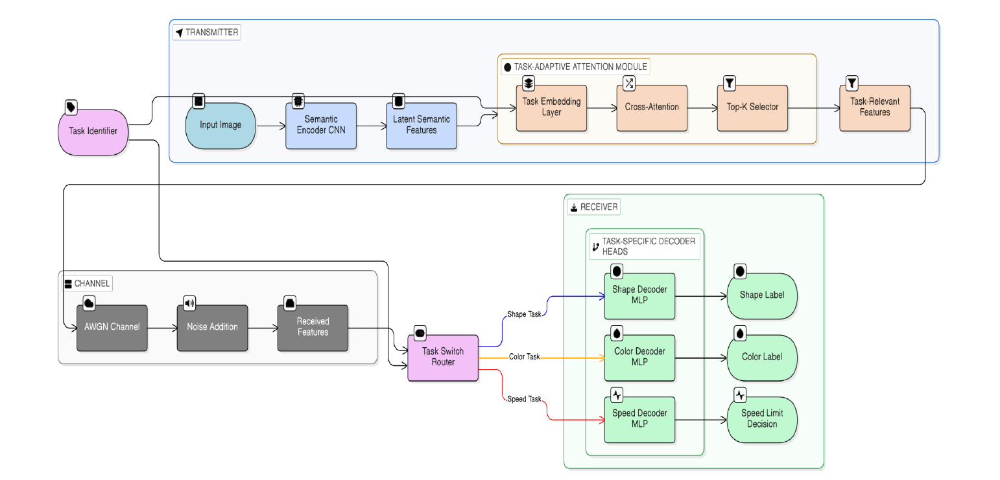
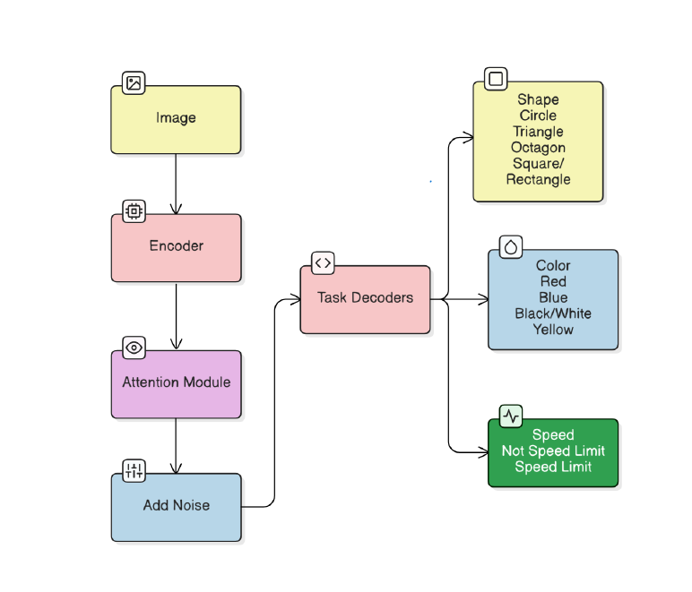

# 🚦 Task-Adaptive Semantic Communication for Multi-Task Traffic Sign Classification

> An end-to-end semantic communication framework that learns compact, task-aware representations for reliable traffic sign understanding under noisy wireless communication environments.


---

## 📑 Table of Contents

- Project Overview
- System Architecture
- System Workflow
- Dataset
- Features
- Experimental Results
- Installation
- Usage
- Folder Structure
- Research Paper
- Authors

## 📌 Project Overview

Traditional communication systems transmit every bit of information regardless of its importance.

This project explores **Semantic Communication**, where only task-relevant information is transmitted, reducing communication cost while maintaining high inference accuracy.

The proposed framework combines:

- Shared CNN Semantic Encoder
- Task-Adaptive Attention Module
- Top-K Semantic Feature Selection
- AWGN Channel Simulation
- Multi-Task Learning
- Task-Specific Decoders

The framework was developed as part of our **B.Tech Thesis (BTP)** and evaluates robustness under varying communication constraints.

---

# 🏗️ System Architecture

The proposed framework follows an **end-to-end semantic communication architecture** designed for efficient multi-task inference under communication constraints.

The system is composed of three major components:

### 📡 Transmitter
- Shared CNN Semantic Encoder
- Task Embedding Layer
- Cross-Attention Module
- Top-K Semantic Feature Selector

### 📶 Communication Channel
- Additive White Gaussian Noise (AWGN) Channel
- Simulates noisy wireless communication environments

### 🖥️ Receiver
- Task Switch Router
- Shape Decoder
- Color Decoder
- Speed Limit Decoder



The architecture jointly learns semantic representation, task-aware reasoning, and task-specific inference in an end-to-end manner, enabling reliable prediction even under noisy communication channels.

---

# 🔄 System Workflow

The overall workflow of the proposed framework is illustrated below.

<p align="center">
    
    
</p>

## ⚙️ Workflow Steps

1. **Input Image**
   - A traffic sign image is provided as the input.

2. **Semantic Encoding**
   - A shared CNN encoder extracts a compact semantic representation from the input image.

3.**Task-Adaptive Attention Module**
   - The Task-Adaptive Attention Module dynamically selects the most informative semantic features for the requested inference task before transmission.

4. **Semantic Transmission**
   - Only the selected semantic representation is transmitted through an **AWGN channel**, reducing communication overhead.

5. **Task-Specific Decoding**
   - Dedicated decoder heads perform inference for:
     - Shape Classification
     - Color Classification
     - Speed Limit Classification

6. **Prediction**
   - The framework generates the final prediction directly from the received semantic representation without reconstructing the original image.

   
---

# 📂 Dataset

The proposed framework is evaluated using the **German Traffic Sign Recognition Benchmark (GTSRB)** dataset, a widely used benchmark for traffic sign recognition.

### Dataset Characteristics

- 🚦 Traffic Sign Images
- 🏷️ Multiple Traffic Sign Categories
- 🔺 Shape Labels
- 🎨 Color Labels
- 🚗 Speed Limit Labels

### Tasks Performed

The semantic communication framework jointly performs three classification tasks:

- Shape Classification
- Color Classification
- Speed Limit Classification

The shared semantic encoder learns compact task-aware representations, while dedicated decoder heads perform inference for each individual task.

---

# ✨ Key Features

- 🧠 **Shared CNN Semantic Encoder** for learning compact semantic representations.
- 🎯 **Task-Adaptive Attention Module** that dynamically selects task-relevant semantic features.
- 📡 **Semantic Communication Framework** that transmits only meaningful information instead of raw image data.
- 📶 **AWGN Channel Simulation** to evaluate robustness under noisy wireless communication environments.
- 🔄 **Multi-Task Learning** for simultaneous shape, color, and speed limit classification.
- ⚡ **Task-Specific Decoder Heads** optimized for individual inference tasks.
- 📉 **Top-K Semantic Feature Selection** to reduce communication overhead while preserving prediction accuracy.
- 🚀 **End-to-End Training** using PyTorch.


   ---

# 📊 Experimental Results

The proposed framework was evaluated using multiple performance metrics to validate its robustness and classification capability under semantic communication constraints.

## Confusion Matrix

The confusion matrix illustrates the classification performance across different traffic sign categories and highlights the model's ability to correctly distinguish between classes.

<p align="center">

</p>

---

## ROC Curve

The ROC curve demonstrates the discriminative capability of the proposed model. The high Area Under Curve (AUC) indicates strong classification performance.

<p align="center">

</p>

### 🔍 Key Observations

- High classification accuracy across multiple traffic sign categories.
- Robust semantic transmission even under noisy AWGN channel conditions.
- Efficient task-aware feature selection using the attention module.
- Compact semantic representations significantly reduce communication overhead.

---

# 🚀 Installation

Clone the repository:

```bash
git clone https://github.com/muskan-rathor/Task-Adaptive-Semantic-Communication.git
```

Move to the project directory:

```bash
cd Task-Adaptive-Semantic-Communication
```

Install dependencies:

```bash
pip install -r requirements.txt
```

---

# ▶️ Usage

Open the notebook in Google Colab or Jupyter Notebook.

Run all cells sequentially to:

- Load the dataset
- Preprocess images
- Train the semantic communication model
- Evaluate performance
- Visualize results
